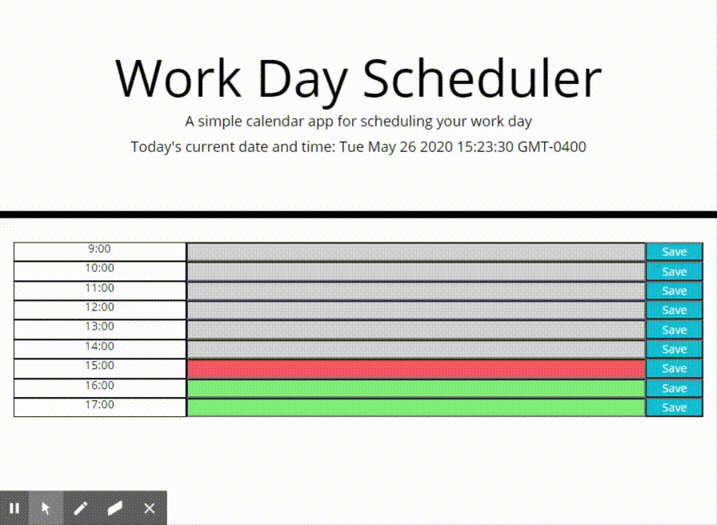

## Table of contents

- [General info](#general-info)
- [Functionality](#functionality)
- [Technologies](#technologies)

## General info

This project is intended to solve one's daily planner needs. It dynamically creates a daily schedule and stores user input and then displays that input back to the user via local storage.

## Functionality

## Technologies

Project is created with:

- Bootstrap version 4
- FontAwesome version 5
- jQuery version 3
- Moment JS
